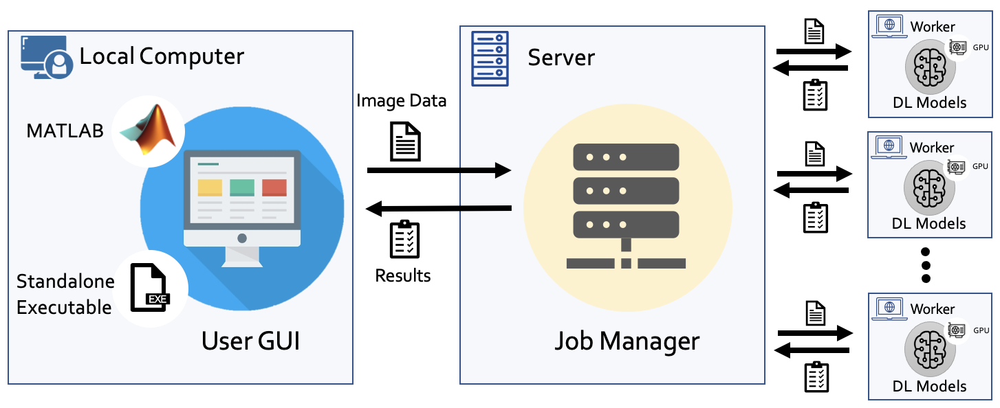
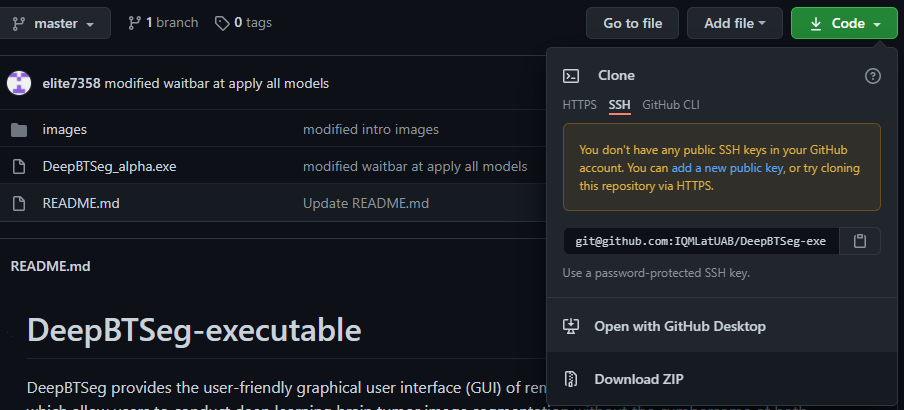
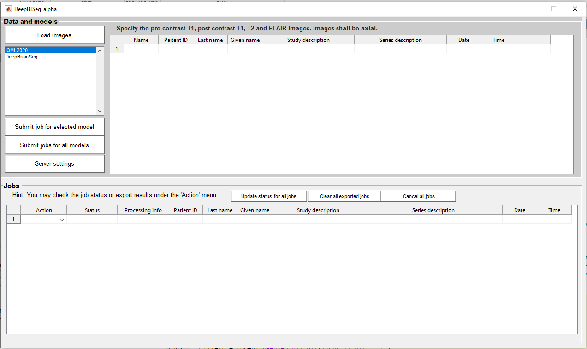
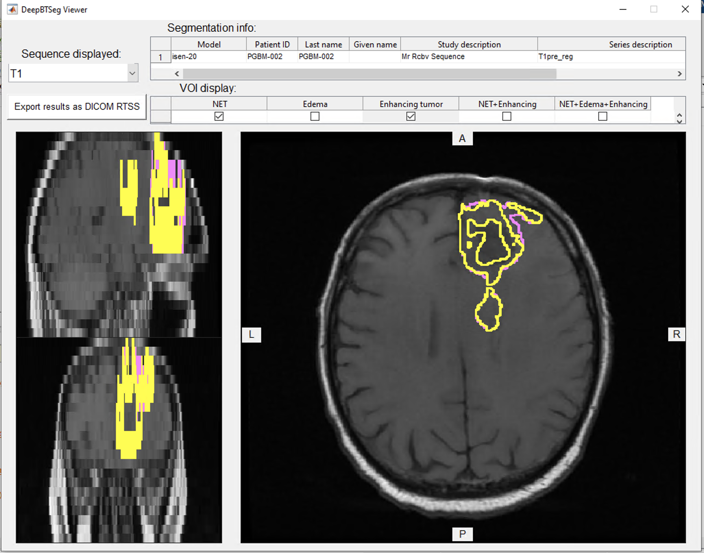

# DeepBTSeg
[](https://github.com/IQMLatUAB/DeepBTSeg)
[](https://)
[](https://github.com/IQMLatUAB/DeepBTSeg)
[](https://github.com/IQMLatUAB/DeepBTSeg)


DeepBTSeg provides a user-friendly graphical user interface (GUI) of remote state-of-the-art deep learning models, which allow users to conduct deep learning  brain tumor image segmentation without the cumbersome of both software and hardware requirements on users' local computers. 

This repository is the client end Matlab code of DeepBTSeg. We also provide the **executable version** of DeepBTSeg [here](https://github.com/IQMLatUAB/DeepBTSeg-executable).
 DeepBTSeg is **developed under Matlab 2020b** and is **executable under Matlab 2019b and Matlab 2020a**. Running the DeepBTSeg Matlab code under **Matlab 2020b is recommended**.

# Usage
## Contents
- [Download](#Download)
- [DeepBTSeg_GUI](#DeepBTSeg_GUI)
- [User_Instruction](#User_Instruction)
## Download

There are two ways that can download DeepBTSeg on the local PC :
1. Dowload DeepBTSeg repository .zip file, then unzip it to the local PC.



2. If the OS is Linux or MacOS, open the terminal, then type
```bash
$ cd YOUR_PREFERRED_INSTALLATION_PATH
$ git clone https://github.com/IQMLatUAB/DeepBTSeg.git
```
After download is finished, Open MATLAB, change MATLAB current folder to the path you download this repo.

## DeepBTSeg_GUI

- This is the User GUI of DeepBTSeg.
- Run `DeepBT_GUI.m` under the `DeepBTSeg` folder in matlab.

## User_Instruction
1. Click `Load images` button select the DICOM folder which needed to be processed.

2. Parse the directory of DICOM images. Under the `Select as` column, specify `T1pre`, `T1post`, `T2`, `Flair` to the corresponding series, then click `OK`.


3. Back to `DeepBT_GUI`, select the desired model that wants to be used during the segmentation process.

3. Click `Submit job for selected model` to transmit this job to the server for processing or click “Submit jobs for all models” to apply all models on the current DICOM image series.

    - Then, the series and the selected model will be composed to a job, then be moved to the lower `Jobs` panel. And, the `Status` will become `Submitted`.

4. Click `Check job` under the `Action` column or `Update status for all jobs` button to refresh the job status and messages from the server, which shown in matlab command window.
    - If the Job is finished, server will send the result back to the client, then `Status` column will change from `Submitted` to `Completed`.

5. After the Job is completed, the user can view the result by click the `View results` option under `Action` column.



6. The above image is a pop-up `image viewer`. Ther are several finction we implemented.
    - User can choose which ROI they want to investigate by clicking the axial, sagittal, coronal sliced images.
    - User can click which segmented label of brain tumor contour they want to explore.
    - User can also switch the different series (T1, T1post, T2, Flair)
    - If user wnat to export this segment result, they can push `Export results as DICOM RTSS` button. Then, the `Action` will become `Exported` in the `DeepBT_GUI`.

7. In `DeepBT_GUI`, click `Export results` under the `Action` column can also save processing results as DICOM RTSS file. 

> when the job status is "Completed". Make sure you export results before you close DeepBTSeg because non-save results will be automatically eliminated.
# Future Work
Right now, we are still working on to implement more DL models on the server so that the user can have more options to segment the brain tumor.

# Maintainer
[@IQMLatUAB](https://github.com/IQMLatUAB)

[@Zi-Min Weng](https://github.com/elite7358)

[@Sheng-Chieh Chiu](https://github.com/chocolatetoast-chiu)